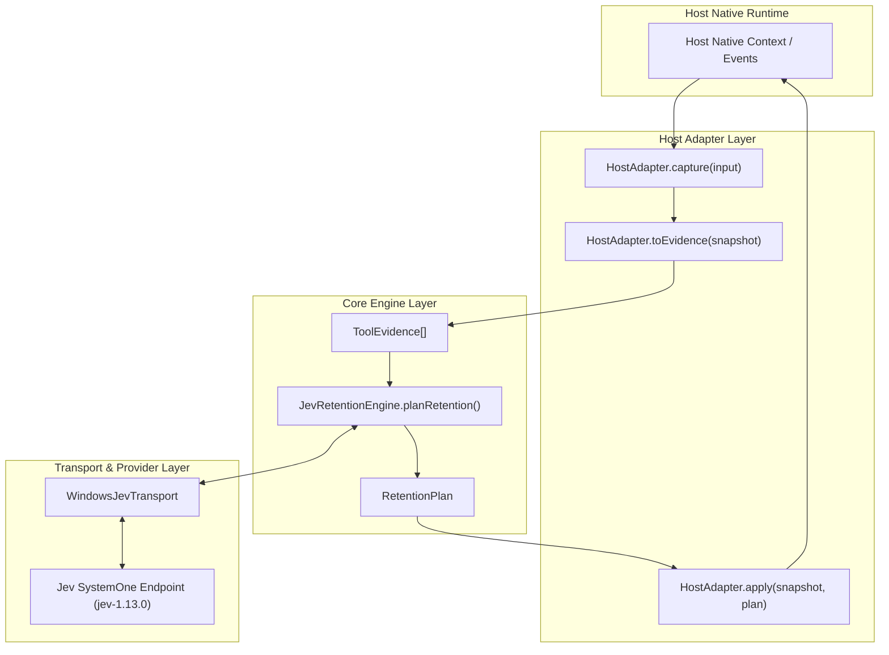

# Jev Context Hosts: Architecture & System Design

## 1. Overview & Objectives

`jev-context-hosts` is an independent host adaptation layer designed to provide **Jev-guided context retention and compaction capabilities** for **Pi** and **Antigravity**. It builds upon the core decision strategies of `save-token-jev` while maintaining complete decoupling from any specific host agent internal transcript schema.



## 2. Core Model Definitions

The core layer does not depend on Pi, Antigravity, or Codex APIs. It operates strictly on minimal generic models:

```typescript
export type ToolEvidence = {
  id: string;
  name: string;
  input: unknown;
  output: unknown;
  isError: boolean;
  replayable: boolean;
  pinned: boolean;
  sourceRef?: string;
  createdAt?: string;
};

export type RetentionAction = "keep" | "truncate_result" | "drop";

export type RetentionDecision = {
  id: string;
  action: RetentionAction;
  keepCall: number;
  keepResult: number;
  reason: string;
};

export type RetentionPlan = {
  decisions: RetentionDecision[];
  model: string;
  provider: string;
  createdAt: string;
  inputHash: string;
};

export interface HostAdapter<Snapshot, Result> {
  capture(input: unknown): Promise<Snapshot>;
  toEvidence(snapshot: Snapshot): ToolEvidence[];
  apply(snapshot: Snapshot, plan: RetentionPlan): Promise<Result>;
}
```

## 3. Retention Policies & Decision Matrix

1. **First User/System Constraint Preservation**:
   - The first user or system message/constraint is unconditionally pinned (`pinned = true`).
2. **Recent Context Pinning**:
   - The latest 6 messages (or equivalent recent turns) are pinned by default.
3. **Threshold-Based Retention**:
   - Default keep threshold: `0.5`.
   - If `keepResult >= 0.5`: `action = "keep"`, `reason = "kept"`.
   - Else if `keepCall >= 0.5`: `action = "truncate_result"`, `reason = "result_truncated"`.
   - Else: `action = "drop"`, `reason = "call_dropped"`.
4. **Minimum Compression Gain**:
   - Default: `0.15` (15%). If total savings ratio < 15%, candidate items revert to `keep` (`reason: "min_compression_gain_unmet"`) to avoid context loss risks for negligible savings.
5. **Strict Pair Coupling**:
   - Tool calls and matching tool results are handled in lockstep: dropping a tool call always deletes the matching tool result.
6. **Orphan Result Protection**:
   - Tool results without an identifiable caller are automatically pinned and never dropped.
7. **Opaque & Non-Replayable Data**:
   - Unrecognized parts or unreplayable side-effects (`replayable = false`) are unconditionally preserved.
8. **Fail-Open Resilience**:
   - Any transport error, timeout, or malformed provider output results in a fallback plan where all items are marked `action = "keep"`.
9. **Credential Redaction**:
   - Sensitive keys (`api_key`, `token`, `password`, `secret`, `authorization`) are sanitized into `[REDACTED]` across previews and logs.
10. **State Deduplication**:
    - SHA-256 state hashes prevent repeated queries or redundant injections for identical contexts.

## 4. Pi Adapter Design

- **Integration Mode**: Native extension registered at `%USERPROFILE%\.pi\agent\extensions\jev-context-compaction.ts`.
- **Standalone Deployment**: Compiled with `esbuild` into a self-contained 22KB ESM module (`--bundle --platform=node --format=esm --target=node20 --external:node:*`). Zero runtime dependency on development repository paths.
- **Coexistence**: Operates side by side with existing `jev-router.ts` without overwrite or naming conflict.
- **Compaction Lifecycle**: Hooks into `session_before_compact` event.
  - Event payload extraction: Correctly inspects `event.preparation.messagesToSummarize` (`AgentMessage[]`), `event.preparation.turnPrefixMessages` (`AgentMessage[]`), `isSplitTurn`, and unpacks `event.branchEntries` (`SessionEntry[]`).
  - Genuine Token Estimation: Computes estimated tokens via `Math.ceil(chars / 4)` when not provided by `tokensBefore`. Eliminates character-token conflation.
  - Return Format: Supplies `tokensBefore`, `estimatedTokensAfter: result.stats.tokensAfter`, and standard `usage: { input, output, totalTokens }` expected by Pi's sessionManager.
  - Fallback: Generates retention plans via `JevRetentionEngine`. If Jev fails or yields an invalid plan, falls back open to Pi's default native compaction.
- **Commands**:
  - `/jev`: Capability routing test using `node:child_process.spawnSync` supplying input to `jevrouter-route.mjs route --stdin`. Accurately reports process failures and exit codes (never masking with false positive success) and explicitly notes that candidate `selected` status only identifies capabilities (`execution: not_started`).
  - `/jev-compact-status`: Displays previous compaction metrics (decisions, tokens saved, chars saved, provider, timestamp).

## 5. Antigravity Plugin Design ("Jev Evidence Recall")

- **Official Designation**: **Jev evidence recall** (Phase 1 does NOT claim native compaction replacement).
- **Directory**: `%USERPROFILE%\.jev-agent\antigravity-plugins\jev-context-compaction\`.
- **Hooks**:
  - `PostToolUse`: Runs `record-evidence.mjs` to capture tool executions. Aligned with official Antigravity contract (hook payload contains tool metadata, error, stepIdx, transcriptPath, but lacks `toolResult`). Tool results are extracted from step output files (`steps/<stepIdx>/output.txt`), explicit `TOOL_RESULT` transcript entries, or sanitized errors; if unavailable, uses the standardized fallback `[Action executed; stdout artifact unavailable]` rather than guessing from planner thoughts. Enforces length bounding on args (<=500 chars) and outputs (<=1000 chars), redacts credentials/tokens, and atomically appends records to `%USERPROFILE%\.jev-agent\data\antigravity\<conversationId>\evidence.json`.
  - `PreInvocation`: Runs `recall-evidence.mjs` when evidence count reaches threshold (>= 2), queries Jev, and injects an `ephemeralMessage` into active context containing both tool call and tool result snippets via `injectSteps`.
- **Atomic Operations**: Safe concurrent writes using temporary files and atomic rename.
- **Session Isolation**: Each `conversationId` has its own isolated folder.
- **Key Resolution Priority**: Key file (`TYPESAFE_API_KEY_FILE` or `%USERPROFILE%\.jev-agent\secrets\typesafe_api_key`) strictly takes precedence; if the file exists but is empty or unreadable, it returns `""` and never falls back to `process.env.TYPESAFE_API_KEY`.

## 6. Phase 2 Reserved Interface

```typescript
export interface NativeCompactionAdapter {
  canReplaceNativeCompaction(): boolean;
  captureNativeCompactionInput(input: unknown): Promise<unknown>;
  replaceNativeCompaction(input: unknown, plan: RetentionPlan): Promise<unknown>;
  restoreAfterCompaction(result: unknown, plan: RetentionPlan): Promise<unknown>;
}
```
In Phase 1, `ReservedNativeCompactionAdapter.canReplaceNativeCompaction()` strictly returns `false`.
